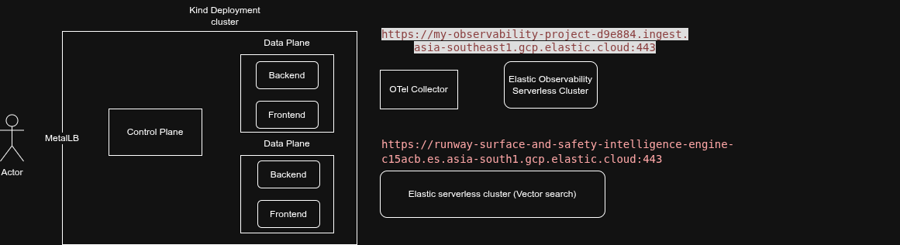
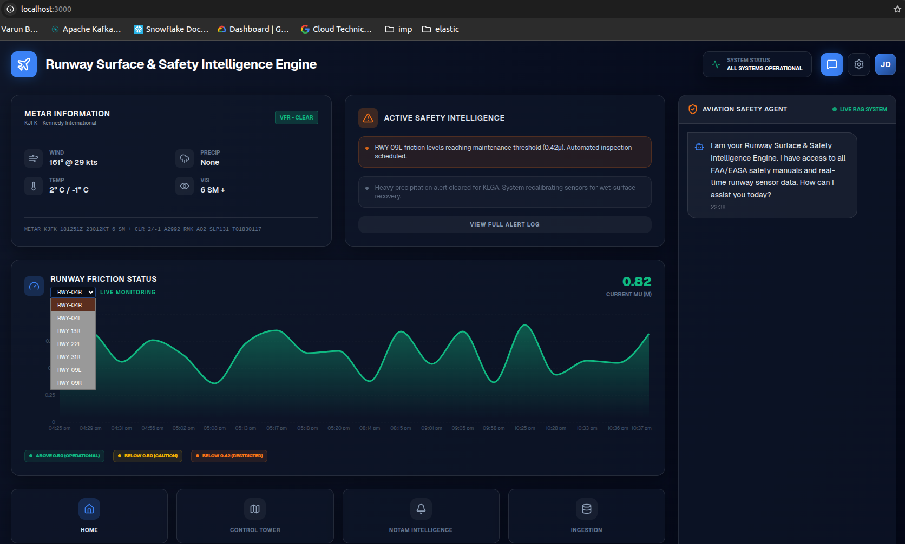
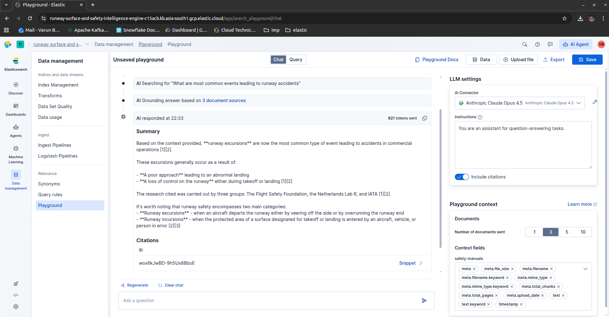

# RSSIE: Runway Surface & Safety Intelligence Engine

RSSIE is a modern, enterprise-grade aviation safety application leveraging a **Decoupled RAG (Retrieval-Augmented Generation)** architecture. It integrates real-time sensor data, weather informatics, and safety manuals to provide actionable insights for airport operations.

## Architecture: Decoupled RAG Pattern

The application follows a decoupled RAG pattern where retrieval (Elasticsearch) and generation (LLM) are orchestrated through a robust NestJS backend.

### Technical Stack

- **Frontend:** [Next.js](https://nextjs.org/) (App Router, Tailwind CSS, Lucide Icons, Recharts)
  - Real-time Runway Friction Dashboards
  - Dynamic Weather Widgets
  - Safety Manual Chat Interface (AI-powered)
- **Backend Orchestrator:** [NestJS](https://nestjs.com/)
  - API Gateway & Business Logic
  - RAG Pipeline (Ingestion, Chunking, Embedding)
  - Vector Search Middleware
- **Primary Database:** [PostgreSQL](https://www.postgresql.org/)
  - (This has not been used here for simplicity, used data generators for simulated datapoints) Structured metadata (Flight schedules, Equipment IDs, User Roles)
- **Vector Database & Search:** [Elastic Cloud Serverless](https://www.elastic.co/serverless)
  - Hosted Vector store for safety manuals (RAG)
  - Integrated observability for real-time sensor and weather logs
- **LLM Integration:** [Jina AI](https://jina.ai/)
  - Vector embeddings and retrival of context for Hybrid search engine to generate human-readable safety insights.

---

## Project Structure

```text
RSSIE/
├── frontend/             # Next.js Application
├── backend/              # NestJS Application
├── infra/                # Docker & ELK Configuration
│   ├── docker-compose.yml
│   └── elasticsearch/
├── skills/               # LLM Skills & System Prompts
└── README.md
```

---

## Getting Started

### Prerequisites
- Node.js (v18+)
- Docker & Docker Compose
- API Keys for OpenAI/Anthropic

### Installation

1. **Clone the repository:**
   ```bash
   git clone <repo-url>
   cd RSSIE
   ```

2. **Setup Infrastructure:**
   ```bash
   docker-compose -f infra/docker-compose.yml up -d
   ```

3. **Backend Setup:**
   ```bash
   cd backend
   npm install --legacy-peer-deps
   npm run start:dev
   ```

4. **Frontend Setup:**
   ```bash
   cd frontend
   npm install --legacy-peer-deps
   npm run dev
   ```

---

## Aviation Safety Manuals (RAG Flow)

1. **Ingestion:** PDF safety manuals are parsed, chunked, and embedded.
2. **Storage:** Chunks and vectors are stored in Elasticsearch.
3. **Retrieval:** User queries are converted to vectors and searched in Elasticsearch.
4. **Generation:** Re-ranked results are passed to the LLM as context for final response generation.

---

## Dashboard Features
- **Runway Friction:** Visualization of GripTester/Mu-Meter data.
- **Weather Integration:** METAR/TAF parsing and visual alerts.
- **Alert System:** Real-time warnings based on sensor thresholds.

## Architecture 

## Frontend 

## RAG Search

